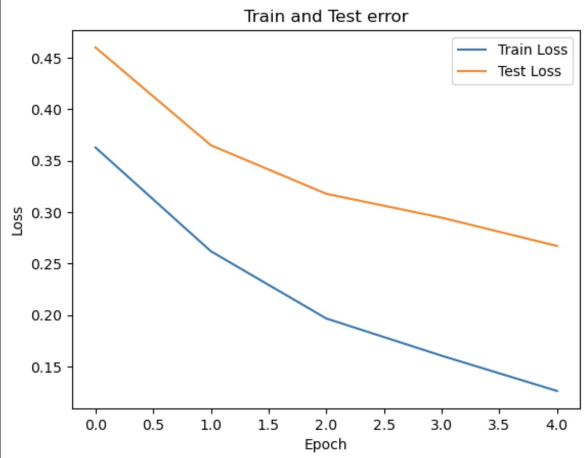
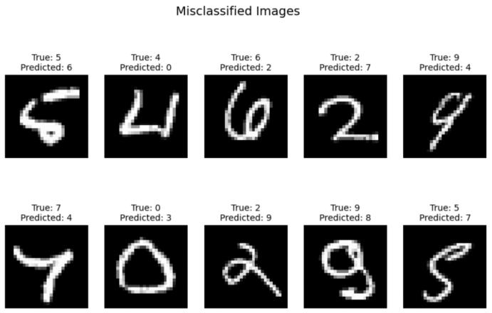
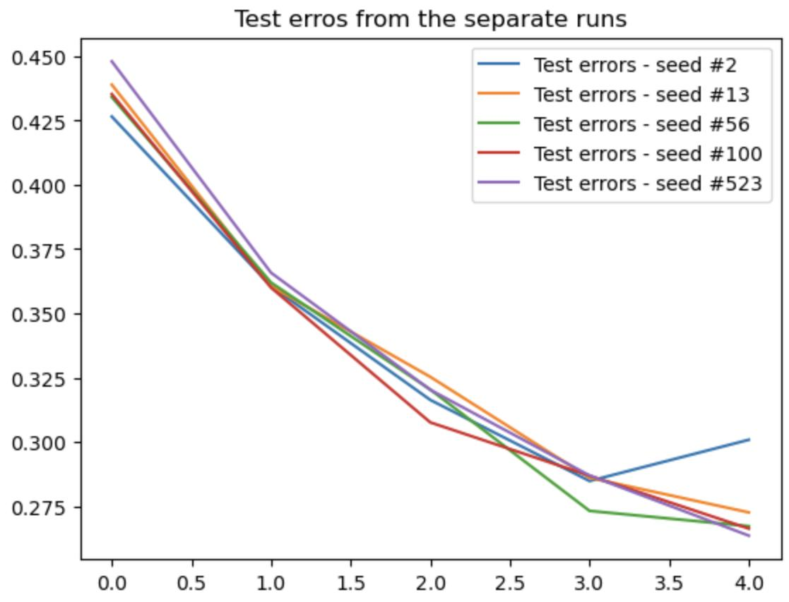
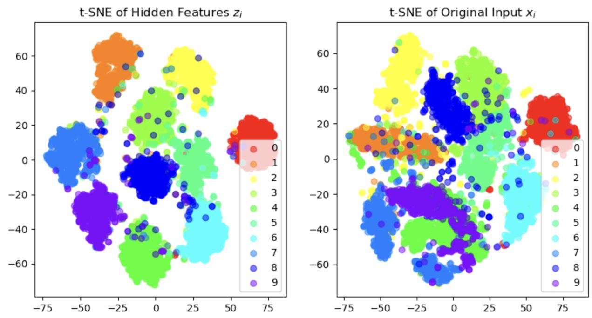

# MNIST Classification with a Fully Connected Neural Network

A PyTorch-based project exploring neural network training, seed robustness, validation-based model selection, hyperparameter tuning, and learned feature visualization on the MNIST handwritten digit dataset.

A 2-layer fully connected neural network (`784 → 500 → 10`) trained with **Adam** (lr=0.001), **CrossEntropyLoss**, for **5 epochs** on 10% of MNIST (~6 000 samples).

---

### Q1 – Baseline Training

The network was trained for **5 epochs** using the baseline hyperparameters. This was done by replicating the code shown in class, using the same hyperparameters.

#### Training Progress

| Epoch | Train Loss | Train Acc | Test Loss | Test Acc |
|:-----:|:----------:|:---------:|:---------:|:--------:|
| 1 | 0.3629 | 89.78% | 0.4602 | 85.40% |
| 2 | 0.2619 | 92.72% | 0.3651 | 89.10% |
| 3 | 0.1966 | 94.65% | 0.3179 | 89.50% |
| 4 | 0.1604 | 95.68% | 0.2946 | 90.50% |
| 5 | 0.1261 | 96.87% | 0.2671 | 91.30% |

> **Final test error: 0.2671**

#### Train & Test Loss

  

Both train and test loss decrease steadily over the 5 epochs, indicating the model is learning without significant overfitting.

#### Misclassified Images

  

A 2×5 grid of test images the model predicted incorrectly, shown with their true and predicted labels. These tend to be ambiguous or poorly written digits.

---

### Q2 – Seed Robustness

The full training pipeline from Q1 was repeated with **5 different seeds**: `[2, 13, 56, 100, 523]`.

#### Test Error Across Seeds

  

#### Statistics

| Metric | Value |
|--------|:-----:|
| **Mean** | 0.2741 |
| **Standard Deviation** | 0.0137 |
| **Variance** | 0.000187 |

**Key finding:** After using 5 different seeds we could observe that the variance was low across all the runs. From that we could conclude that our model was **robust to the choice of seeds** — the random initialization does not significantly affect the final performance.

---

### Q3 – Validation-Based Model Selection

A **validation set of 1 000 samples** was randomly sampled from the training data. For each of the 5 seeds, the epoch with the **minimum validation error** was selected, and the corresponding test error was reported.

#### Per-Seed Results

| Seed | Min Validation Error | Corresponding Test Error |
|:----:|:--------------------:|:------------------------:|
| 2 | 0.2881 | 0.2839 |
| 13 | 0.2819 | 0.2670 |
| 56 | 0.2860 | 0.2669 |
| 100 | 0.2782 | 0.2642 |
| 523 | 0.2775 | 0.2724 |

> **Best result:** Seed 523 achieved the lowest validation error of **0.2775**, with a corresponding test error of **0.2724**.

---

### Q4 – Hyperparameter Tuning

A **grid search** was performed over three hyperparameters, yielding **27 combinations** in total:

| Hyperparameter | Values |
|:--------------:|--------|
| Batch size | 100, 200, 300 |
| Hidden size | 500, 1000, 1500 |
| Learning rate | 0.001, 0.01, 0.1 |

#### Full Results

| # | Batch Size | Hidden Size | Learning Rate | Validation Error | Test Error |
|:-:|:----------:|:-----------:|:-------------:|:----------------:|:----------:|
| 0 | 100 | 500 | 0.001 | 0.2889 | 0.2750 |
| 1 | 100 | 500 | 0.010 | 0.2197 | 0.2265 |
| 2 | 100 | 500 | 0.100 | 0.5969 | 0.6751 |
| 3 | 100 | 1000 | 0.001 | 0.2393 | 0.2399 |
| 4 | 100 | 1000 | 0.010 | 0.2622 | 0.2625 |
| 5 | 100 | 1000 | 0.100 | 0.4774 | 0.5617 |
| 6 | 100 | 1500 | 0.001 | 0.2326 | 0.2200 |
| 7 | 100 | 1500 | 0.010 | 0.2323 | 0.2624 |
| 8 | 100 | 1500 | 0.100 | 0.4796 | 0.4886 |
| 9 | 200 | 500 | 0.001 | 0.2792 | 0.2581 |
| 10 | 200 | 500 | 0.010 | 0.2816 | 0.2475 |
| 11 | 200 | 500 | 0.100 | 0.5600 | 0.7370 |
| 12 | 200 | 1000 | 0.001 | 0.2464 | 0.2369 |
| **13** | **200** | **1000** | **0.010** | **0.2067** | **0.2166** |
| 14 | 200 | 1000 | 0.100 | 0.5505 | 0.5506 |
| 15 | 200 | 1500 | 0.001 | 0.2349 | 0.2168 |
| 16 | 200 | 1500 | 0.010 | 0.2248 | 0.2576 |
| 17 | 200 | 1500 | 0.100 | 0.4789 | 0.4986 |
| 18 | 300 | 500 | 0.001 | 0.2783 | 0.2776 |
| 19 | 300 | 500 | 0.010 | 0.2309 | 0.2231 |
| 20 | 300 | 500 | 0.100 | 0.5993 | 0.6667 |
| 21 | 300 | 1000 | 0.001 | 0.2423 | 0.2216 |
| 22 | 300 | 1000 | 0.010 | 0.2170 | 0.1961 |
| 23 | 300 | 1000 | 0.100 | 0.6705 | 0.7650 |
| 24 | 300 | 1500 | 0.001 | 0.2491 | 0.2293 |
| 25 | 300 | 1500 | 0.010 | 0.2676 | 0.2884 |
| 26 | 300 | 1500 | 0.100 | 0.5761 | 0.6695 |

> **Best combination (#13):** Batch Size = **200**, Hidden Size = **1000**, Learning Rate = **0.01** — Validation Error = **0.2067**, Test Error = **0.2166**

---

### Q5 – t-SNE Feature Visualization

Two **t-SNE** (t-distributed Stochastic Neighbor Embedding) plots are generated side-by-side, each color-coded by digit class (0–9):

- **Left** — Hidden features **z_i**: output of the first linear layer + ReLU (500-d → 2-d)
- **Right** — Original inputs **x_i**: raw pixel vectors (784-d → 2-d)

  

#### Analysis

| Aspect | x_i (raw input) | z_i (learned features) |
|--------|:----------------:|:----------------------:|
| Cluster separation | Overlapping | Well-separated |
| Misplaced points | Higher count | Significantly fewer |
| Interpretability | Hard to distinguish digits | Clear digit boundaries |

**Key finding:** The most significant difference noticeable between the plots is that in the **x_i plot** we can notice overlapping between the clusters and a higher number of points being in the wrong cluster. On the other hand, for the **z_i plot** we can notice a much more distinct separation between each cluster and a much lower amount of points in the wrong cluster. What this tells us about the learned model is that the first layer of the network is **successful at learning features that are useful for the classification**. This is most shown by the separation of clusters in the z_i plot.

---

## License

This project was created for educational purposes as part of a deep learning course assignment.

